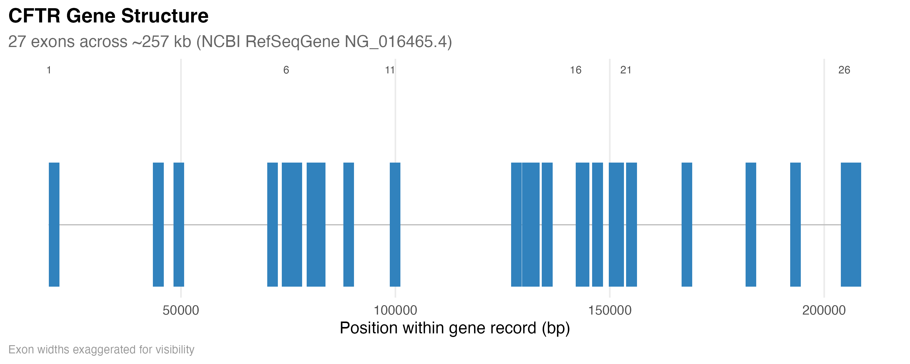
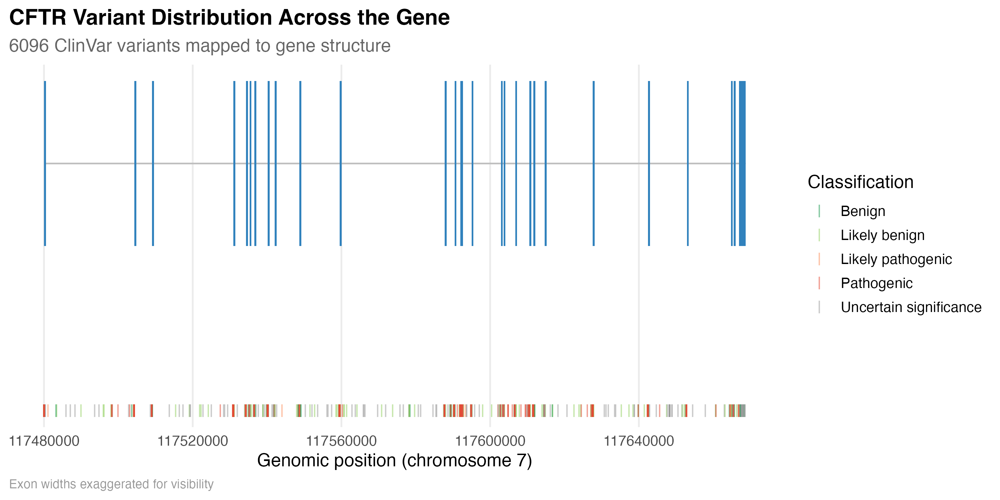
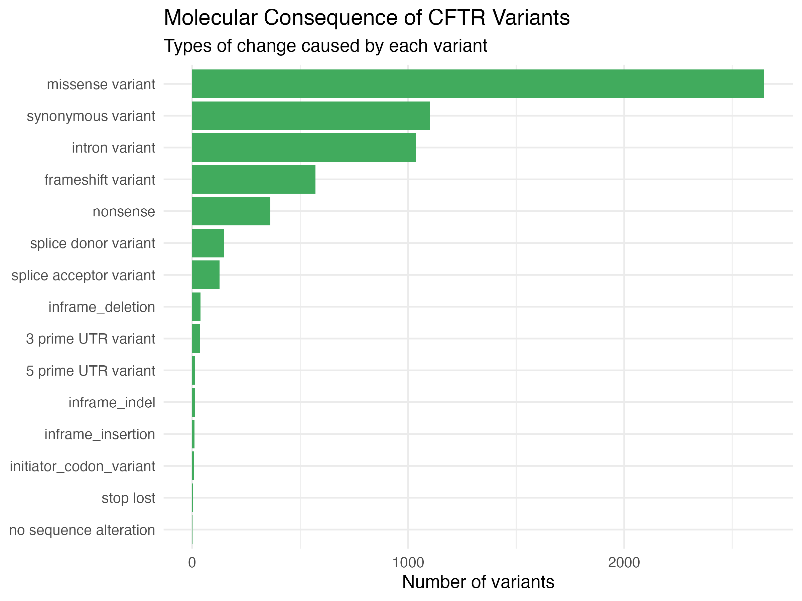
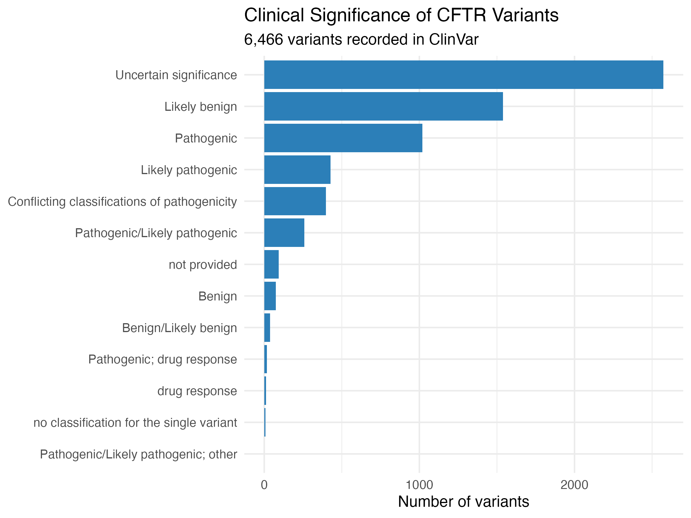
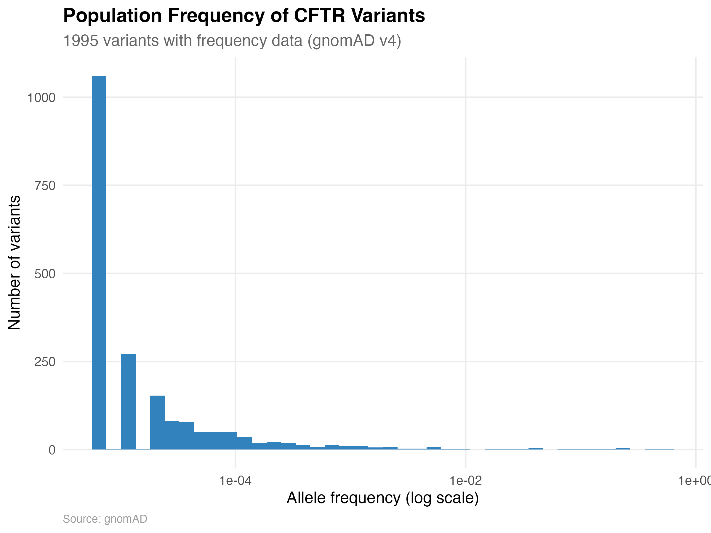

# CFTR Variant Analysis

An exploration of genetic variation in the *CFTR* gene — the gene associated with cystic fibrosis — using real public genomic databases.

## Why CFTR?

As a Microbiology and Molecular Biology student, I wanted to explore a clinically significant, well-studied gene using real public genomic databases rather than simulated data — 
and CFTR's scale and clinical relevance made it a strong candidate for practicing full-pipeline bioinformatics work.

## Overview

This project pulls, cleans, and visualizes variant data for *CFTR* (CF transmembrane conductance regulator) to explore:
- The gene's structure (exons and introns)
- Where known variants fall within the gene
- What types of molecular consequences those variants cause
- Their clinical significance (pathogenic vs. benign)
- How common each variant is in the general population

## Data Sources

- **[NCBI RefSeqGene (NG_016465.4)](https://www.ncbi.nlm.nih.gov/nuccore/NG_016465.4)** — verified exon/intron structure
- **[ClinVar](https://www.ncbi.nlm.nih.gov/clinvar/)** — 6,466 variant records with clinical classification and molecular consequence
- **[gnomAD v4](https://gnomad.broadinstitute.org/)** — 7,577 variants with population allele frequency data

## Figures

**Figure 1: Gene Structure**

CFTR's 27 exons spread across ~257 kb on chromosome 7.

**Figure 2: Variant Distribution**

6,096 ClinVar variants mapped onto the gene structure, colored by clinical classification.

**Figure 3: Molecular Consequence**

Types of change caused by each variant (missense, synonymous, splice, etc.).

**Figure 4: Clinical Significance**

Breakdown of variants by pathogenicity classification.

**Figure 5: Population Frequency**

Distribution of allele frequencies — most CFTR variants are individually rare.

## Tools

R, tidyverse, ggplot2, rentrez (NCBI), httr/jsonlite (gnomAD API)

## Reproducing this analysis

Scripts are numbered in the order they should be run, in the `scripts/` folder. Data pulled from NCBI and gnomAD is cached in `data/` so the analysis doesn't require re-querying external APIs each time.

## Author

Claudia Brady — BSc Microbiology and Molecular Biology, Manchester Metropolitan University